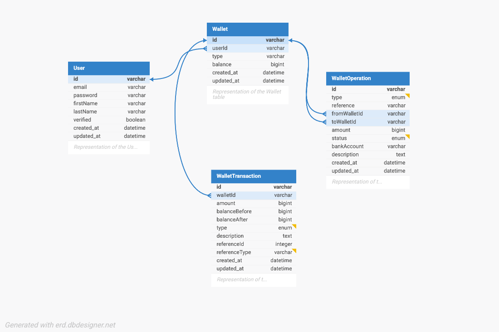

## Demo Credit API

Node.js + Express + TypeScript REST API for basic auth and wallet operations using MySQL (via Knex).

### Stack

- **Runtime**: Node.js, Express
- **Language**: TypeScript
- **DB**: MySQL (Knex)
- **Auth**: JWT (local strategy)
- **Validation**: Joi
- **Tests**: Jest + Supertest

## Getting started

### 1) Environment variables

Create `.env` (and `.env.test` for tests) with the following at minimum:

```
ACCESS_TOKEN_SECRET=changeme
REFRESH_TOKEN_SECRET=changeme
AUTH_ISSUER_BASE_URL=http://localhost

DATABASE_HOST=127.0.0.1
DATABASE_NAME=demo_credit
DATABASE_USER=root
DATABASE_PASSWORD=secret
DATABASE_PORT=3306
```

Note: `src/common/config.ts` requires `ACCESS_TOKEN_SECRET`, `REFRESH_TOKEN_SECRET`, `AUTH_ISSUER_BASE_URL` at startup.

### 2) Install

```
npm install
```

### 3) Migrate the database

There are 3 types of migration in this project

```
npm run migrate:dev #development environment
npm run migrate:test #test environment
npm run migrate:prod #production environment
```

### 4) Run

```
npm run dev    # development
# or
npm start      # builds then runs compiled JS
```

The server exposes:

- `GET /` → health/info
- `ALL /v1/**` → API routes

## Routes

### Root

- **GET /**
  - 200: `{ status: true, message: "<env>-DEMO-CREDIT API v1.0" }`

### Auth (`/v1/user/auth`)

- **GET /**
  - 200: `{ status: true, message: "Auth Reached" }`
- **POST /register**
  - body: `{ email, password(min 7), firstName, lastName }`
  - 200: `{ success: true, message, data: { accessToken, refreshToken } }`
  - 422: Joi validation errors
- **POST /login**
  - body: `{ email, password }`
  - 200: `{ success: true, message, data: { accessToken, refreshToken } }`
  - 401: invalid credentials
  - 422: validation errors

### Wallets (`/v1/wallet`) — requires `Authorization: Bearer <accessToken>`

- **GET /**
  - 200: `{ success: true, message, data: Wallet[] }`
  - 401/403 on missing/invalid token
- **GET /:id**
  - 200: `{ success: true, message, data: WalletWithHistory }`
  - 401/403 if unauthenticated; 400/404 on errors
- **POST /:id/transaction**
  - body: `{ type: 'deposit'|'withdrawal'|'transfer', amount, toWalletId?, description?, bankAccount? }`
  - Middleware: auth → validate(Joi) → convertToCents → checkUserWallet
  - 200: `{ success: true, message: "Transaction successful" }`
  - 400: business errors (e.g., insufficient balance)
  - 422: validation or ownership errors

Notes:

- Amounts are submitted in major units (e.g., `100.00`), middleware converts to cents internally.
- Registration creates a default wallet for the user.

## Database Schema

### Tables

#### User

- `id` (UUID, primary key)
- `email` (string, unique, indexed)
- `password` (string, hashed with argon2)
- `firstName` (string)
- `lastName` (string)
- `verified` (boolean, default: false)
- `created_at`, `updated_at` (timestamps)

#### Wallet

- `id` (UUID, primary key)
- `userId` (UUID, foreign key → User.id, CASCADE delete, indexed)
- `type` (enum: "naira" | "dollar", default: "naira")
- `balance` (bigInteger, default: 0) — stored in cents
- `created_at`, `updated_at` (timestamps)

#### WalletTransaction

- `id` (UUID, primary key)
- `walletId` (UUID, foreign key → Wallet.id, CASCADE delete, indexed)
- `amount` (bigInteger) — in cents
- `balanceBefore` (bigInteger) — in cents
- `balanceAfter` (bigInteger) — in cents
- `type` (enum: "credit" | "debit")
- `description` (string, nullable)
- `status` (enum: "pending" | "completed" | "failed", default: "pending")
- `referenceId` (string, nullable, indexed) — links to WalletOperation.id
- `referenceType` (string, nullable) — e.g., "deposit", "withdrawal", "transfer"
- `created_at`, `updated_at` (timestamps)
- Unique index: `(walletId, referenceId, referenceType, type)` — for idempotency

#### WalletOperation

- `id` (UUID, primary key)
- `type` (enum: "transfer" | "withdrawal" | "deposit")
- `reference` (string) — unique operation reference
- `fromWalletId` (UUID, nullable, foreign key → Wallet.id)
- `toWalletId` (UUID, nullable, foreign key → Wallet.id)
- `amount` (bigInteger) — in cents
- `status` (enum: "pending" | "completed" | "failed", default: "pending")
- `bankAccount` (string, nullable) — for withdrawals
- `description` (string, nullable)
- `created_at`, `updated_at` (timestamps)

### Relationships



**Details:**

- **User → Wallet**: One-to-many (a user can have multiple wallets)
- **Wallet → WalletTransaction**: One-to-many (each transaction records a balance change)
- **WalletOperation**: Represents a business operation (deposit/withdrawal/transfer)
  - For **deposits**: only `toWalletId` is set
  - For **withdrawals**: only `fromWalletId` is set
  - For **transfers**: both `fromWalletId` and `toWalletId` are set
- **WalletOperation → WalletTransaction**: One operation may create multiple transactions (e.g., a transfer creates two: one debit, one credit)

### Notes

- All monetary amounts are stored in **cents** (bigInteger) to avoid floating-point precision issues
- Balance is computed from `WalletTransaction` records (balanceAfter from the latest transaction)
- The idempotency index on `WalletTransaction` prevents duplicate transaction records for the same operation
- Foreign keys use CASCADE delete: deleting a user deletes their wallets, which deletes their transactions

## Project structure (high-level)

- `src/routes/**` → route definitions per feature
- `src/controllers/**` → HTTP controllers (shapes responses, calls services)
- `src/services/**` → business logic and DB interactions
- `src/middleware/**` → auth, validation, checks, converters
- `src/connectors/knex.connector.ts` → Knex instance (per `NODE_ENV`)
- `migrations/**` → Knex migrations

## Testing

### Commands

```
npm test            # runs with NODE_ENV=test
npm run test:watch
```

### Approach

- **Environment**: Use `.env` with a dedicated test DB and the required JWT secrets. `knexfile.ts` contains a `test` environment using your envs.
- **Boot**: The app exports the Express `app` and only listens when `NODE_ENV !== 'test'`, so Supertest can run in-memory.
- **Migrations**: Run migrations before tests (see "Migrate the database"). Optionally, wire global setup to migrate automatically.
- **Auth flow in tests**:
  - Register a user via `POST /v1/user/auth/register`.
  - Capture `data.accessToken` and set `Authorization: Bearer <token>` for subsequent requests.
  - Query `/v1/wallet` to get the user wallet ID.
  - Use `/v1/wallet/:id/transaction` to exercise deposit/withdraw/transfer scenarios.

### Sample coverage

- Auth validation (422) and login/register happy paths.
- Wallet auth gating (401/403), list user wallets, wallet details.
- Transactions:
  - Deposit success, Withdrawal success, Transfer between users.
  - Negative: insufficient funds, invalid type, missing `toWalletId` for transfer.

## Scripts

See `package.json`:

- `dev`: compile and run in watch mode (development)
- `start`: compile and run built JS
- `test`, `test:watch`: Jest + Supertest

## Notes

- Ensure the DB user has privileges to create/alter tables and run transactions.
- JWT secrets must be stable across test runs to validate tokens.
